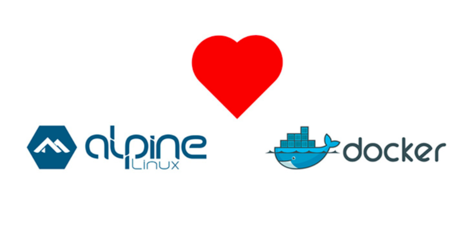
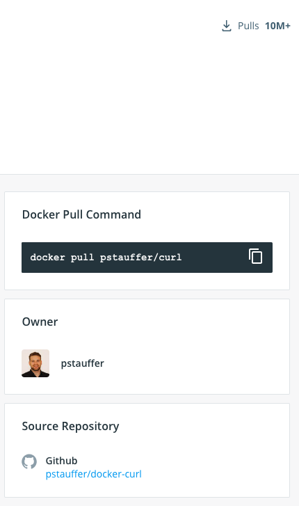

Содержание
- базовые концепции сборки образов
- сборка простейшего образа
    - docker build
    - docker run
    - docker exec
- сборка боевого образа
- FAQ
    - всегда ли запускать с "-d"?
    - собирается слишком большой образ
    - собирается слишком долго
    - Dockerfile
        - ADD vs COPY
        - RUN vs CMD vs ENTRYPOINT
    - где и как хранятся образы?
    - latest или не latest?
    - как выбрать образ из моря доступных?


#### Сборка образа

Для сборки image'а используется пошаговая инструкция, описываемая Dockerfile'ом. 

Ты уже заметила парралели с ООП: образ == класс, а контейнер == инстанс (экземпляр, объект) этого класса.
Так вот, на этом параллели не заканчиваются. 

Сборка образа всегда начинается с выбора базового образа. По аналогии с ООП-наследованием,
образы, можно сказать, так же наследуются друг от друга. По аналогии с тем, как в java/scala есть  
самый базовый класс Object, у докера тоже есть такой самый-самый базовый образ - `scratch` ("from scratch" == с нуля).

Такой подход (фактически, наследование) выбран не с проста: в основе того, как докер хранит данные 
внутри образа лежит файловая система Union File System (UnionFS). Проще всего это продемонстрировать на картинке: 


Union она потому, что умеет как бы склеивать разные слои создавая единое пространство. Раньше файлики
F1 и F2 лежали в своей файловой системе, а файлики F3 и F4 - в своей, то есть они не видели друг друга. 
Можно сказать что это были 2 физически разных жестких диска. 

После объединения (union) они поместились в общее пространство. То есть теперь они лежат в одной файловой
системе, полученной путем наложения двух других. Теперь они видят друг друга.


Так вот, на этом "уровневом"/слоеном принципе построен докер:

Умные люди (разработчики докера) на основе самого-самого базового образа `FROM scratch` (считай пустого) 
создали образы линуксов - Ubuntu, debian, centos, mint и тд. - то есть они смогли упаковать линукс в Union FS.
То есть поверх базового образа scratch появился слой с линуксом:
- scratch
- ubuntu linux

Так появились первые образы Linux'ов.

Но ведь операционная система нужна для запуска программ - что толку от голого линукса? 
Тогда они взяли за основу уже имеющийся линукс `FROM linux`, например ubuntu, установили в нее python и получили образ питона:
- scratch
- ubuntu linux
- python

Но кому нужен "тупо питон"? Питон нужен для выполнения программ. И тогда ты, взяв за основу, 
образ питона `FROM python3.8` добавляешь в него свою программу, а заодно и библиотеки, зависимости, конфигурацию, и, может быть данные.
Получается такой слоеный пирог (рисую в иерархии ООП)
- scratch
- ubuntu linux
- python3.8
- слой с твоими данными /project/src, /data, /whatever

И вот теперь, когда ты соберешь это воедино, получится цельная картинка:
- вот твоя программа, которую ты можешь запустить питоном
- вот питон, скомпиленный компилятором GCC 
- вот компилятор GCC ("гцц", Gnu C Compiler) идущий в комплекте с убунтой
- и все они видят друг друга (находятся в одном пространстве, одной файловой системе)
- и все это весит условные 100МБ и запускается чуть ли не на калькуляторе!

То есть у тебя есть все, что нужно для запуска программы. 

## Простейший образ

Пришло время собрать свой образ.

Нет ничего проще `echo`. Давай попробуем помесить `echo fuck` в образ? 
Ведь процесс`echo fuck` ничем не отличается от `python3.8 my-awesome-script.py`.

1. Важно помнить следующее: **контйенер жив, пока жив процесс**. 

Как только процесс внутри контейнера останавливается, считается, что крутить контейнер нет смысла. 
То есть если просто вывести 1 раз echo, то ровно это и прозойдет - контейнер создастся, процесс с echo напишет "fuck", 
процесс зваершится, и контйенер будет остановлен.

2. А еще важно помнить, что у Bash'а (shell'а в общем случае) есть альтернативная форма записи:
```bash
echo fuck
# это то же самое, что и
/bin/bash -c "echo fuck"
```

- В первом случае ты выполняешь ее в терминале, где баш работает по умолчанию. 
- Во втором ты явно говоришь выполни команду `echo fuck` интерпретатором `/bin/bash`. 
    - Для чего? Кроме баша есть bin/sh, zsh, ash и даже fish, хоть все они и браться близнецы

Принимая пункт 1 во внимание, можем сделать бесконечный цикл, который бы ругался:
```bash
while true; do echo fuck; sleep 2; done
```

Принимая во вниамение п.2, запишем команду в немного другом виде:
```bash
/bin/bash -c "while true; do echo fuck; sleep 2; done"
```

Итак, цикл бесконченый, значит процесс и контейнер не умрут. 
И докеру теперь понятно, что команду надо проитерпретировать именно башем. Можем собирать

#### Docker build

Создадим файл `Dockerfile` (у докерфайла нет расширения):
```Dockerfile
FROM ubuntu:18.04

ENTRYPOINT ["/bin/bash", "-c", "while true; do echo fuck; sleep 2; done"]
```

- возьмем знакомую нам убунту
- укажем входную точку ENTRYPOINT. Это команда, которая будет запускаться при выполнении `doker run`
    - особенность в том, что надо передать команду и аргументы как массив 
    
Для сборки выполняем:
```bash
docker build -t fucker .
```

Это минимальный ее синтаксис. Флагом `-t fucker` обозначается имя. Собрать безмянный образ нельзя. При этом, пока ты
не собираешься его пушить вяскую лишнюю инфу типа `mchera/spark:3` - репозитория, версии и прочей фигни - можно не писать. 
Готовый образ всегда можно перетегировать, указав тег-до и тег-после: `docker tag fucker mchera/spark:3`.

Происходит следующее:
```
Sending build context to Docker daemon 10.34MB
Step 1/2 : FROM ubuntu:18.04
 ---> 56def654ec22
Step 2/2 : ENTRYPOINT ["/bin/bash", "-c", "while true; do echo fuck; sleep 2; done"]
 ---> Using cache
 ---> a68bc672cb10
Successfully built a68bc672cb10
Successfully tagged fucker:latest
```

У нас собрался образ fucker (и протеггировался как `latest` по умолчанию).


#### Docker run

Можем его запустить:
```bash
docker run fucker
```

Это минимальный синтаксис запуска котнейнера. echo пошел писать факи. У меня не получилось остановить его на Ctrl-C - 
пришлось открывать соседний терминал, выполнять `docker ps` и останавливать контейнер `docker stop`'ом. Напомню еще раз,
что для всех команд, нацеленных на конкретный контейнер, контейнер можно указывать либо через имя (последний столбец в
`docker ps` - там всякие дурацкие имена типа "крадущийся тигр" и "затаившийся лось", либо через ID. 

При этом не надо указывать весь огромный ID типа `6a6942475da61b4ce9cc5b3fadb42642ea90e...` - достатчно указать несколько
символов, чтобы докер однозначно понял о каком контейнере ты говоришь. Как правило это 2-3-4 первых символа: `docker stop 6a`


Почему контейнер не хотел останавливаться на Ctrl-C я не знаю, видимо слишкам простая команда была. Джава, питон или постгрес
остановились бы - они умеют обрабатывать сигнлаы `kill -<цифра>` которые шлет им докер при нажатии Ctrl-C.

Запустим еще раз, но теперь с флагом `-d` (== `--detach`). Детач значит "отсоединить". То есть докер запустит контейнер и
отсоеденит его от текущего терминала (то есть как бы "в фоне"):
```bash
docker run -d fucker
> c854332e0d5b970f9d4f5f79527aeb36748b25faa5690a6db827a91f5382edfe9d
```

На этот раз он не захватитл наш терминал, круто.


#### Docker exec

Теперь давай посмотрим, что именно запускается - ведь там на борту убунта.
Для выполнения команд над работющим контейнером используют `docker exec`. В общем случае exec выполняет "какие-то" команды.
Некоторые простые команды можно выполнить не залезая в контейнер. 

Залистим, например, процессы, работающие внутри:
```bash
docker exec c85 ps ux

USER         PID %CPU %MEM    VSZ   RSS TTY      STAT START   TIME COMMAND
root           1  0.1  0.1  18376  3148 ?        Ss   14:24   0:00 /bin/bash -c while true; do echo fuck; sleep 2; done
root          95  0.0  0.0   4532   844 ?        S    14:26   0:00 sleep 2
root          96  0.0  0.1  34404  2852 ?        Rs   14:26   0:00 ps ux
```

Мы заглянули внутрь контейнера. Тут можно сделать еще одно замечание:
- все процессы выполняются из-под рута
- процесс с PID 1 - главный (т.н. init, инициализирующий всю систему). именно его мониторит докер
- процесс 1 нельзя убить через `kill -9` - для этого у докера свои хитрости
- процессов всего несколько, это не тысячи процессов, что работают на твоей машине.

Это круто, что мы смогли это сделать, не заходя внутрь, но зайти-то хочется.

Выполняем интерактивный вход:
```bash
docker exec -it c85 bash
```

Что есть что:
- exec говорит, что мы будем выполнять команду над контейнером. Сам контейнер идет чуть дальше: ID `c85....`
- поскольку это не одноразовая команда (типа `ls` или `ps ux`), а полноценная консолька с башем, понадобятся флаги
- Флаг `-i` (`--interactive`) - "присосаться" к текущему терминалу
- Флаг `-t` (`--tty`) - TTY-это устройство ввода
- Флаги можно комбинировать: `-it`
- Я запомнил мненмонично так: `выполнить -Iнтерактивный -Tерминал`  

И вот мы зашли в контейнер, можем делать здесь все что захочется, даже `rm -rf /` :)
Здесь стандартная (местами урезанная) убунта, со всеми `/home` и `/usr/bin` и так далее.

Выйти - Сtrl-D - стандартный способ выхода (хоть из ssh, хоть из докера).

Как правило в боьшинстве случаев проще зайти в контейнер, чем пытаться скормить команду снаружи, как мы сделали это с `ps ux`'ом,
ибо это не так легко с командами сложнее ps ux'а.

В общем теперь мы научились заходить в контейнер и работать с ним как со стандартным линуксом. Контейнер нам больше не понадобится.


Если тебе это интересно, то да, в докере можно запустить докер. А в том другой, и так далее... это называется dind (docker-in-docker)


#### Docker build посложнее

Давай теперь попробуем что-то посложнее чеем факи в консоль. Для следующего эксперимента нам понадобится 
пройстейшее Flask'овское приложение. 

Я знаю, что ты не любишь это вот все, но я взял самый минималистичный пример, который смог придумать, чтобы
- было приложение которое крутится в контейнере
- с ним можно взаимодействовать
- оно имеет зависимости (собсна сам фласк)
- оно имеет данные (веб-страничка)

Дата-саенс-пример я придумать не смог, так что потерпи чуть-чуть, пожалуйста.

Будет вот такая директория проекта (утилита tree):
```
.
├── app.py
├── requirements.txt
├── static
│   └── index.html
└── venv
```

В директории проекта создадим venv, requirements и установим фласк:
```bash
virtualenv -p python3.8 ./venv
source venv/bin/activate
echo Flask==1.1.2 > requirements.txt
pip install -r requirements.txt
```

Создадим веб-страницу, которую будет отдавать наш flask, файлик `./static/index.html`:
```html
<html>
<body>
Hello from Mary
</body>
</html>
```

Создадим файлик `./app.py` с сервером:
- что за static? статический контент == веб-страницы. Мы говорим фласку искать веб-странички в папке `./static`
- почему `0.0.0.0` вместо локалхоста? `0.0.0.0` обоначает "все доступные хосты" на машине, сюда входит и локалхост. 
Это особенность работы докеровских сетей, примем как данное

```python
from flask import Flask

app = Flask(__name__,
            static_url_path='',
            static_folder='static')

@app.route('/')
def root():
    return app.send_static_file('index.html')

@app.route("/hello")
def hello():
    print("accepted request")
    return "nice to meet you"


if __name__ == '__main__':
    app.run(host='0.0.0.0', port=5000)
```

и сразу запустим, коль скоро venv активирован `python app.py` (для всех действий выше даже пайчарм не нужен)

Видим, что сервер запустился на порту :5000
- Отправим ему курловый запрос `curl localhost:5000/hello`
- Зайдем на http://localhost:5000 в барузере

Видим, что и на курловые запросы отвечает и страничку отдает, значит все работает! Сделаем еще пару запросов и 
обратим внимание, что сервер каждый раз пишет в лог при получени запроса.

Если ты сейчас захочешь раздать проект в интернет, тебе придется повторить все эти действия на AWS/GCP/Azure машинке.

##### Контейнеризация


Я выбрал именно такой пример, потому что он похож на реальные приложения, хотя и максимально прост.

Создаем Dodkerfile. Какие к нему требования?
- для запуска приложения в контейнере, нам надо подготовить ему окружение. Та самая фишка докера, что он упакоывает и 
несет с собой все **окружение** проекта: 
    - приложение (app.py)
    - зависимости (объявлены в requirements.txt) 
    - данные (веб-страничка index.html)
    
Собственно, все то, что мы сделали руками выше, надо оформить в виде инстркуции `./Dockerfile`:
```Dockerfile
# В качестве базового возьмем образ питона 3.8 (почему именно такой - будет понятно из FAQ)
FROM python:3.8-alpine

# внутри контейнера нам не от кого изолироваться, так что зависимости ставим прямо в системный питон
COPY 
```


- полный список команд см в докумнтации:    
  


### Опция --detached

**Навеяно опытом: Никогда не запускаю контейнеры с опцией -d**

Почему?
- Котнейреы пишут в STDOUT логи процесса. То есть твои `System.out.println`, `print` или `log.info` будут видны.
- Если я запускаю что-то сторонее (постгрес), то я вижу как стартует и работает процесс. Конечно, там много лишней информации
- Иногда контйенеры не стартуют. В случае детача (`docker run -d fucker`) я бы 
    - заметил (например, спустя пару часов), что контейнер не стартанул, 
    - выполнил бы `docker ps` и увидел что контейнера там нет, ибо он давно мертв. 
    - Выполнил бы `docker ps -a` и среди мертвых (их там будут десятки и сотни) с трудом нашел бы свой.
        - не поленись, посмотри соклько их там у тебя
    - глянул бы логи `docker logs <ID>` если они еще там
- в случае с аттачд запуском (обычный `docker run fucker`) я жертвую вкладкой терминала, но зато я сразу вижу,
что вот постгрес стартанул, вот к нему подклюилось мое приложение, а вот произошла ошибка с запросом, а вот он нафиг упал
- чтобы остановить такой контейнер, надо лишь нажать Ctrl-C, не нужно опять же ps'ить и stop'ить
- можно бвыстро крутнуться по вкладкам терминала и окинуть взглядом все контейнеры

Цена за это - научиться создавать новвую вкладку (Cmd T) и перевключаться между ними туда-сюда

Даже если ты случайно закроешь теорминал, процесс не закроется сам (даже если ты нажмешь "прервать")


### Слишком жирный Docker-образ

Докер образ во время сборки захватывает в т.н. "build context" (контекст сборки) - всю директорию в которй лежит Dockerfile.
Как правило, докерфайл кладут в корень проекта, чтобы упаковть внутрь артефакты проекта
- артефактами java/scala/go и др компилируемых языков являются исполняемые файлы. Например, jar-ки. В образ java-приложения нет смысла нести исходники 
- артефактами python/ruby/scheme приложений являются исходники.

После сборки иногда (например на "долгих" проектах) удивляются, что образ оказался на сотню-другую МБ жирнее, чем ожидалось.
Это связано как раз с мусором, попавшим в контекст сборки. 

Зачастую это содержимое папки `.git`. Можно по приколу сделать следующее - добавить в гит-репозиторий файл в 1ГБ, 
запушить, затем удалить файл и снова запушить. В репе как бы ничего нет, но в ее истории будет лежать тот гиговый файл.
Тогда следующем человеку придется клонировать 1Гб данных, хотя реальное текущее состояние проекта - 3 файлика по 10Кб :)
"Тяжеля" история может накапливаться и без больших файлов - например, за многие годы работы над проектом 

Еще неприятный момент - утащить что-то чувствуительное - например, файлик с паролями, ssh-ключами или apikey'ями.

Проблемы типично-гитовые, решение - тоже. Исопльзуется файл `.dockerfile`. [Пример такого файла](https://github.com/avbelyaev/K8S-RBAC-experiments/blob/master/.dockerignore).
Отмечу, что у `.gitignore` и `.dockerignore` немного отличается синтаксис - где-то нужны слэши, где-то нет - каждый 
раз подглядываю

**Best practice: использовать .dockerignore, чтобы в образ не утекло лишнего**


### Образ собирается очень долго

Каждая инструкция докерфайла генерит новый слой. Слои характиерузуются хешами. Рассмотрим кусок докерфайла:
```Dockerfile
ADD src .
RUN pip install numpy 
```

Докер:
- взял образ питона
- добавил исходники, посчитал хеш слоя Х
- установил зависимость, посчитал хеш следующего слоя
- собра весь образ

Ты поработала надо кодом, код теперь другой. 

Докер:
- взял образ питона, образ такой же
- добавил исходники, они другие, пересчитал хеш -> создал новый слой
- установил зависимость, зависимость поверх новых исходников дала новый хеш -> докер создал новый слой
- собраз весь образ.

Переставим порядок команд в докерфайле:
```Dockerfile
RUN pip install numpy 
ADD src .
```

Докер:
- взял образ питона
- накатил нампай сверху, посчитал хеш
- накатил исходники, посчитал хеш

Тепреь даже если ты поменяла исходники, сменить надо лишь тонкий верхний слой с исходниками, т.е. пару килобайт данных.
Коль скоро версия нампая зафиксирована в реквайрментах, меняться она не будет и перебилдивать слой докеру незачем.

**Best practice: Упорядочивать команды в докерфайле в зависимости от частоты обновления слоя**. В самом верху - то,
 что не будет меняться, в самом низу докерфайла - то, что меняется часто (например, исходники).

**Best practice: обощение предыдущего правила: чейним команды, в одну большую**. Причина все та же - если команды генерят
данные, которые редко меняются (например, ты ставишь curl, wget и питоновские зависиомсти), то их надо объеденить в одну,
чтобы докеру не пришлось генерить лишний слой.

Проще всего продемонстрировать это на примере этого докерфайла: https://github.com/AdoptOpenJDK/openjdk-docker/blob/master/11/jdk/alpine/Dockerfile.hotspot.releases.full


### Dockerfile ADD vs COPY

Вижу иногда используют ADD, иногда COPY для одних и тех же действий, в чем разница?

COPY только копирует файлы внутрь образа, а ADD умеет добавлять еще и из урла. Я ни разу в жизни не использовал ADD,
но для этого гайда написал именно ADD, т.к. понимаю, что для тебя это может быть частый кейс- подгрузить данные 
из источника.

Есть еще какая-то фишка с обработкой архивов ADD'ом (он вроде умеет сразу распаковывать), 
но на практике не использовал - не скажу.

В общем, я и дальше буду привычный COPY использовать, а тебе рекомендую присмотреться к ADD :)

Документация всех команд: https://docs.docker.com/engine/reference/builder/ 


### Dockerfile RUN vs CMD vs ENTRYPOINT

- RUN - выполняет промежуточное дейтвие **на этапе сборки**, например, установку чего-либо. Как и любая команада, порождает новый слой.
- ENTRYPOINT vs CMD
    - честно, я и сам не знаю. Там есть тонкости с выполненем в `/bin/sh` по умолчанию, с возможностью оверрайда CMD, но
  мне на практике не приходилось использовать CMD и я всегда использую ENTRYPOINT, чтобы указать дефолтную команду.
    - я пока не знаю юзкейс твоей работы, но, предполагая, что в твоих контейнерах вместо фласков (постоянного процесса),
    будет изолированное выполнение чего-то, думаю, что тебе может подойти CMD. Но лучше либо ты разберешься и объяснишь мне,
    либо разберемся вместе в привязке к конкретному юзкейсу. 

Документация всех команд: https://docs.docker.com/engine/reference/builder/ 


### Где хранятся образы

По аналогии с тем, как питоновские модули хранятся в pypi, java'овые артефакты хранятся в maven, docker-образы 
хранятся в docker registry, реестре (регистри) образов. Самый известный - Dockerhub - публичное хранилище докер образов.
Пока ты не зупашила туда образ, он хранится локально (`docker images`). Компании, как правило, имеют свои приватные хранилища.


Хотя сам докер и проприетарен (закрытое ПО), создать образ может каждый. Представь, что 1000 человек взяли за основу 
образ python, добавили сверху исходники своих программ 
- и сделали 1000 образов. Каждый примерно в 100МБ. Никакого места не хватит все это хранить - 100 ГБ. 

Так вот на самом деле значительная часть объема во всех этих образах будет одна и та же - тот самый линуск с раскатанным
поверх питоном - те самые парочка базовы слоев. Тогда хранить надо лишь 1! образ linux, 1! образ питона и 1000 папочек с исходниками.
Сколько там нынче весят исходники? Десяток килобайт? Тогда для хранения всего этого добра надо всего 10 МБ!

В этом в том числе и молниеносность пуша/пулла образов. Если у тебя на компе уже есть слой с питоном, то надо лишь
допуллить недостающее. Если на докерхабе уже есть образ линукса, надо лишь допушить недостающее. Спасибо Union FS. 

Слои (вернее их хеши) ты видишь во время пуша/пулла образа 

```
11: Pulling from library/postgres
4297e0229558: Pull complete 
bbb46d73f55c: Pull complete 
644c45c53969: Pull complete 
a4d0e23f5eaf: Extracting [=========>                                     ]  13.37MB/21.12MB
a4d0e23f5eaf: Extracting [=====================>                         ]  14.88MB/30.42MB
81bc5e1a0d35: Download complete 
78b6752b1630: Download complete 
a2e04e4389c1: Download 
```

* Слоев "между тобой и базовым" не 4 (scratch, ubuntu, python, твой), а скорее десяток, но сути это не меняет. 

По новой политике Dockerhub'а образы не востребованные в течение (кажется) 6 месяцев, удаляются. Поэтому сейчас появляется
все больше альтернативных хранилищ - Github packages (у меня в профиле есть отдельная вкладка с ним), AWS ECR и другие.


### Версионирование

Как ты знаешь, образ характериузется версией (тегом). Взять `cpython:alpine-3.8` - здесь `alpine-3.8` - тег.

Фишка докера - в **иммутабельности** образов! Это значит, образ, протегированный как `whatever:1488` всегда будет создавать
одинаковые контейнеры. 

Однако, теги можно редактировать. И под `whatever:1488`можно подложить образ с видосиком "never gonna give you up" вместо
исходников. Это считается дурной практикой и как правило запрещено правилами регистри (хотя в dockerhub так можно). 
Как описано выше, образы очень экономно расходуют место и теги можно не жалеть. 

Тэг `latest` - плавающий - он всегда указывает на самую последнюю новую версию образа. Как только выходит новая версия
образа, она помечается тегом latest. При этом в новой версии могут быть не обратносовместимые изменения (breaking changes).

Здесь все точно так же, как и с любым версионированием. На проде версия должна быть жестко зафиксирована. 
В работе, меж тем, можно использовать что угодно.

**Best practice: исопльзовать для локальной работы то же, что будет будет крутиться в проде**. Ибо дьявол кроется в деталях


### Как выбрать образ

Обычной практикой является гугление `<whatever> docker image` и, если это что-то достоано мейнстримное, 
первая ссылка будет вести на Dockerhub. Но, в случае с чем-то супер-мейнстримным, типа питона, открыв 
вкладку Tags, ты столкнешься с [52 страницами образов](https://hub.docker.com/_/python?tab=tags&page=52) (нояб 2020).
Как выбирать - непонятно.

Тогда некоторые образы были облегчены и названы slim - это указано либо в тегах либо в самих названиях, типа `3.8-slim`.
Еще есть версии stretch и buster - это какие-то отсылки к Debian linux'у на котором построены образы, но я с ними не знаком.

В какой-то момент умные люди перестали терпеть такую неразбериху и собарли т.н. alpine-образы. 



Ты много где увидишь/услышишь слово "alpine" (альпайн, альпИн) в контексте докера. Alpine - это легковесный линукс.
В то время, как Ubuntu, Fedora, Mint, Arch и т.д. весят сотни МБ или гигабайты, Alpine,  будучи полноценным 
linux'ом, не тащит за собой мусор - ему не нужны драйвера для мышки и набор иконок - это все вырезано. 
Поэтому, он весит всего 5! (пять) мегабайт! 

Идей алпайна - избавиться от всего лишнего, таким образом облегчив образы и ускорив их старт

Вслед за alpine-linux появились и облегченные версии всех возможных технологий. "Обычный" питон может весить до 500МБ,
alpine-python весит пару десятков МБ, ведь из него вырезали лишние предустановленные библиотеки, профилировщик, справки и тд. 
Обычная джава весит до гигабайта, alpine-jre весит пару сотен МБ. Гуглятся alpine-образы так же - `<whatever> alpine image`.

**Best practice: предпочитать легковесные alpine-образы обычным**

И да, `alpine-python-3.8`, `python-3.8-alpine`, `3.8alpine` и `alpine3.8` - это все еще __разные__ образы! 
Альпайны облегчили сами образы, но не процесс выбора среди других альпайнов. Раньше ты бы выбирала из океана образов, 
сейчас ты выбираешь из моря алпайн образов.

Иногда alpine может выстрлить в ногу, когда в нем не окажется библиотеки, нужной твоему модному пайспарку, 
но написанной каким-нибудь сербом в 1998 году. Я на практике такого не встречал, но это стоит иметь в виду.

А вот nano, vim, netstat, curl и даже bash в алпайне скорее всего не будет. Это все пользовательские отладочные утилиты и в
продакшене они не нужны. Их всегда можно самостоятельно добавить поверх алпайна

Возвращаясь к выбору
- Есть ли alpine-образ?
- Есть ли хотя бы облегченная slim версия?
- официальный ли образ
- количество скачиваний (у мейнстримных это всего 1М+, 100М+)
- внизу обычно есть ссылка на гитхаб репо. в этой репе может лежать один голый докерфайлик на 3 строчки но зачастую
даже на такие репозитории не скупятся звездочками
- это все указано справа




TODO

докер жалко - на бесплатном ПО далеко не уедешь

образ скалы

docker-compose
