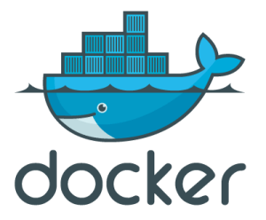

# Продуктивизация модели

## Step 1 (baseline)

_примерное время: 3-5 часов_ 

_теги: API, HTTP (TCP/IP, методы, статусы, header'ы), терхзвенная архитектура, REST HTTP API, endpoint (controller), cURL, XHR_

Я, как пользователь, могу зайти в приложение и ввести текст в единственное текстовое поле.
После нажатия кнопки "Analyze", в интерфейсе я вижу значение тональности введенного текста, либо сообщение об ошибке в остальных случаях.

Ожидаемый результат:
- фронтенд с текстовым полем, кнопкой и показом результата классификации
- бекенд, обрабатывающий запросы от фронта
- классификатор, выполняющий саму логику классификации
- все работает локально в браузере

### Классификатор

Разработку будем вести снизу вверх. См подробнее [внизу](#виды-разработки).

Начинаем разработку с самого нижнего слоя. У нас в самом низу - классификатор.

Надо выделить интерфейс классификатора, он же API. Подробнее см [внизу](#api)

Если я сторонний разработчик, то мне не важно, как внутри работает твоя модель и уж тем более я не знаю,
как ее пиклить и какие нумпаевские методы дергать. Поэтому я бы хотел импользовать ее как билиотеку, котрая предосталяла бы API типа такого:
```python
t = TonalityAnalyzer()
tone1 = t.analyzeTone(text='Ужасно смешной фильм', lang='ru')
tone2 = t.analyzeTone(text='the movie was fcking awesome!', lang='en')
```

Но! т.к. модельку делаем мы сами, то мы знаем как ее дергать, поэтому такую обертку над моделькой можно сейчас не городить.
Главное, чтобы она делала свою работу (принимала строку и возвращала результат классификации), а уж в каком виде - сейчас не важно.


### Бекенд

Бекенд отвечает за бизнес-логику приложения и связывает пользовательскую часть с классификатором.

Предлагается реализовать API со следующим контрактом:

- Определение тональности переданного текста 
    - POST `/api/tonality/analyze` - это называют **endpoint** (или контроллер) - то есть "конечная точка" соединения, т.е. место, куда приходит запрос от клиента
    - Принимает json вида:
```json
{
  "text": <строка, текст для анализа>
}
```
    - Тональность опеределена успешно: 200 OK и json вида: 
```json
{
  "tone": <float, число обозначающее тональность>
}
```

Мы хотим спроектировать API. API это вещь абстрактная, т.е. это просто о том, как с объектом взаимодействовать, но мысли никто
читать не умеет, а объект, с которым мы хотим работать находится где-то на сервере в интернете, так что нам нужно что-то физическое, 
с помощью чего можно организовать это взаимодействие. В данном случае самая физическая вещь, что у нас есть - протокол HTTP - hypertext transfer protocol. 

Про то, как работает HTTP смотри [внизу](#http)
 
- Помнишь, мы в классификаторе хотели сделать удобное API над моделькой? 
    - Так вот, там мы реалзиовывали API с помощью языка python, т.к. объект, с которым мы хотели работатьт был питоновским объектом ( в терминах ООП).
    - получаем python API
- Сейчас у нас "объект" находится где-то на сервере в недрах интернета 
    - И его API надо реализовывать так, чтобы мы смогли с ним работать через интренет
    - получаем HTTP API
    - HTTP API обычно отвечает "требованиям" REST. Про REST см [внизу](#rest)

Бекенд должен предоставлять описанный выше **REST HTTP API** и тогда с ним можно будет взаимодейстовать с помощь curl, бразуера, python-requests и здравого смысла.

##### Задания 
0. Реализовать описанный выше HTTP API на Flask'е
1. Прежде чем делать фронт, надо понять что бек работает. 
    - Как запустить бекенд без пайчарма?
2. Как локально дернуть API curl’ом?
    - раньше мы делали что-то типа `curl --data ... localhost:8080/do/smth` и передавали заголовки и сам json 
3. Убедиться что запросы приходящие на бекенд отображаются в stdout 
    - иначе будет сложно отлаживать работу, не понимая, дошел запрос до бека или потерялся в дебрях сетей AWS
4. _доп_ На каждый приходящий запрос писать в лог (для начала `print`), кто его отправил, т.е. User agent отправителя
    - можно будет увидеть, что вот пришел запрос от хрома, вот от curl'а, а вот - от веб-краулера
  
##### Контрольные вопросы
1. В чем отличие HTTP методов POST, PUT, HEAD?
2. Каким заголовком мы можем "попросить" сервер вернуть нам в качестве ответа НЕ json, а, например, xml или html?
3. Набросать HTTP API интернет магазина (просмотр товаров, добавление в корзину, оформление заказа) - хотя бы 3-4 ендпоинта
4. Можно ли удалять документы (пусть документ == пользователь) выполняя GET-запрос `/api/users/<id>`?
5. HTTP не хранит состояние (он не знает что перед запросом Y был запрос X) - как в таком случае сказать серверу, что мы уже встрчались (и логинились) - иначе он каждый раз будет простить нас залогиниться?

  
  
### Фронтенд

UI выглядит максимально просто:
- текстовое поле для ввода ссобщения
- кнопка "Analyze", по нажатию которой текст отправляется на анализ тональности
- блок, показывающий тональность введенного сообщения (например, числом от 0 до 1) 

Технически максмально прост:
- файл с разметкой и описанными выше тремя ключевыми элементами страницы
- файл со стилями, чтобы смотрелось красиво 
    - предложил бы вообще забить на CSS в начале, т.к. на CSS может уйти времени больше чем на весь этот tutorial
- файл с js-кодом, отвечающий за отправку запроса, получение ответа и отображение ответа на странице. 
    - чтобы отправить запрос, надо считать введенный в текстовое поле текст, обернуть его в json и отправить (с соблюдением всех заголвоков и всего, что мы отлаживали curl'ом)
    - в ответе надо принять json, расправсить его поле `tone` и вывести значение в какой-либо элемент на странице (google "add text to div")

##### Задания
0. Реализовать фронтенд
1. Реализовать асинхронную отправку запросов
    - веб работает аснихронно и запрос тоже должен быть асинхронным (синхронный запрос выполняется синхронно, т.е. блокрирует выполнение остальных команд, пока
  не будет завершена текущая. Сеть ненадежна и ответ может не прийти никогда - тогда клиент навечно зависнет). 
    - самый простой способ - XHR - см [здесь](https://learn.javascript.ru/xmlhttprequest)
2. убедится, что запросы доходят до бека
    - они должны уходить на host:port где разернут бекенд
    - запросы из браузера так же видны во вкладке "networks" в dev tools (chrome F12)
3. Настройка CORS. 
    - cURL отправляет запросы AS IS, "как есть". Браузер работает более деликатно
    - Браузер, прежде чем что-либо куда-либо слать, сначала спросит, готов ли сервер принять такой запрос. 
    - Такой предварительный запрос называется preflight request. 
    - Надо уметь его принять на беке и верно ответить, иначе браузер не будет выполнять "основной запрос"
    - Ошибки CORS как правило заметны в dev tools (вкладки "network" и "console"), chrome F12
4. наконец, запустить фронтенд, чтобы его можно было открыть в браузере по адресу `http://localhost` 
    - мы раздавали фронт с помощью встроенного питоновского веб-сервера (`python3 -m http.server ...`)
    - настроить правильный порт для разадачи фронтенда
5. _доп_ сделай собственную красивую кнопку с помощью `<div>`
    - Посмотри свойства `hover` и `active` html-элемента и почитай про свойство `onclick=` 
 

##### Контрольные вопросы
0. В URL укзаано, что мы идем на `https://google.com`. Но этот путь указывает не на конкретную страницу, а тупо на хост.
    - какой файл сервер по умолчанию будет искать, ведь страничку гугла мы все-таки увидим?
1. Какой порт используется протоколом HTTP по умолчанию? 
    - какой у HTTPS? какой используется протоколом SSH?
2. Какой HTTP статус говорит о том, что документ не найден?
    - за что отвечают статусы 2хх? 3хх? 4хх? 5хх?
3. Можно ли ответить статусом 666 на запрос, например, создания пользователя? 
4. Как почистить куки в хроме?
5. Как удалить дурацкий баннер на Pinterest, который закрывает экран, если ты не залогинен?
    - баннер это точно такой же html-элемент как и все что есть на странице. занчит, он подчиняется тем же законам, что и остальные элементы
    - значит, мы можем "работать" с ним через dev tools и можем вырезать его со страницы :)
6. уметь объяснить что значит каждый тег в начале занятия

---


## Step 2 (раздача фронтенда с бекенда)


_примерное время: 1 час_ 

_теги: DNS, резолвинг адресов, статика_

в этой серии мы научимся оперировать приложением, как единым целым и запускать одним процессом

Выше мы сделали бейзлайн нашего приложения, или можно сказать MVP - minimal viable product == минимальную рабочую версию.
Она работает локально, но пришло время дать пользователям доступ к ней. Для этого необходимо сделать ряд изменений в базовой версии.

- Как ты помнишь, сейчас фронтенд запускается отдельным процессом с помощью стандартного питоновского веб-сервера. 
Этот веб-сервер разадет все, что находится в текущей директории (в том числе пресловутый index.html), откуда запущен процесс.
- Бекенд запущен как питоновское приложение
 
Но, как ты понимаешь, это все-таки 2 разных процесса - один раздает фронтенд, другой крутит бекенд.

Действия пользователя:
- Я, как пользователь, открываю твое приложение по адресу `http://maryblack.rocks`
    - Я нахожусь в мск
    - а сервер с приложением крутится где-то на западном побережье америки
- мой браузер делает запрос на хост 1.2.3.4 и порт :80 за стартовой страничкой index.html
    - за то, как `http://maryblack.rocks` резловится в `http://1.2.3.4` отвечает DNS - я тебе о нем говорил. Можно считать, что это map{hostname -> ip}: `DNS["marybcloak"]="1.2.3.4"`
    - на сервере мне отвечает тот питоновский процесс, который сидит на порту :80 - с ним я общаться могу.
    - у меня в браузере в москве открылась страничка с твоим приложением (то есть мне прилетели мои "копии" html,css,js и отрендерили приложение)
    - я ввожу текст и нажимаю кнопку "Analyze". Внимание, вопрос, куда уйдет запрос? 
        - На какой хост:порт? ведь мне нужно достучаться до единственного конкретного сервера в америке!
        - кто его на том хосту:порту примет? подумай, как оно может быть устроено
        - а ответ - ниже:
          
##### на какой хост:порт уйдет запрос?
- существуют _абсолютные_ и _относительные_ адреса - ты это, думаю, знаешь. 
    - абcолютный адрес: `https://maryblack.rocks/models/tonality/index.html?foo=bar`
    - отнсительный: `/foo/bar/baz`. говоря об относительной адресации всегда надо понимать _относительно чего_ идет адресация
    - запрос можно сделать *только собрав полный (абсолютный) URL* (ведь нам нужно получить ip-адрес по hostname'у от DNS, но hostname'а в отнсительном адресе нет)
- так вот, в запросах мы раньше явно указывали полный абсолютный URL бека: `http://localhost:5000/api/tonality/analyze` 
- но мы ведь хотим, чтобы со страницы, открытой у меня на компе в мск запрос ушел на сервер в америку, но мы 
    - не всегда знаем адрес сервера (мы не знаем где в конце концов будет крутиться наша страничка, если это огромный сайт/портал типа гугла или Я)
    - мы не хотим хардкодить этот адрес: представь что у нас на странице 100 кнопок - тогда придется 100 раз писать на копках адреса типа `http://foo.com/api/x`, `http://foo.com/api/y` и тд
- умные люди (разработчики браузеров) решили эту проблему конвенионально:
    - если в запросе указан относительный URL (см выше), то он будет рещолвиться *относительно текущего сайта*
    - то есть запрос `/new_dir/index.php?r=blah` выполненный со страницы `http://www.foo.com/bar.php`
    - будет зарезолвлен в `http://www.foo.com/new_dir/index.php?r=blah` (т.е. относительно текущего сайта `foo.com`)
    - а конпки, как ты понимаешь, и знать не знают полные URL - на каждой из них написано лишь `/api/x`, `/api/y`, `api/z`
- так вот, в нашем случае запрос `/api/tonality/analyze` пойдет на `http://maryblack.rocks/api/tonality/analyze` и нам при этом не надо указывать ни хост, ни порт.


##### кто его на том хосту:порту примет?
- по-правильному решается это с помощью проксирования запросов (тот самый Nginx)
- запросы так же приходят на один сервер (он и раздает *статику* - статический, редко меняющийся контент, и обслуживает вызовы к API)
- но дальше в зависимости, от типа запроса, в ответ отдается либо статика (html/css/js, картинки, видосики), либо запрос перенаправляется на бекенд. 
    - самое интуитивное правило роутинга: если запрос начианется на `/api/**`, то мы его проксируем, например:
        - Запрос `http://maryblack.rocks/models/tonality` вернет index.html
        - Запрос `http://marycloak.rocks/api/models/tonality` будет запроскирован на бекенд и ответит на него сам бекенд
        
Проксировать умеют все сервера (Apache, Nginx и т.д.), но возиться с прокси - это не то, чего мы хотим (хотя можем, если интересно :) ). 

Поэтому мы можем пойти в другую сторону: сделать так, чтобы наш бекенд одновременно 
- раздавал статику (наши 3 файлика)
- раздавал HTTP API
- занимал при этом только 1 порт

Веб-серверы, коим является и Flask, из коробки умеют раздавать статику. Это решается, как правило, конвенционально: 
- встроенный `pythom -m http.server` раздается текущую директорию
- Nginx раздает папку `./var/nginx/html`
- Django рдздает папку, например, `./assets`
- Flask раздает папку ??? (Я не знаю, какую именно директорию он раздает)

если к этому моменту у тебя возникла путаница в "серверной" терминологии, то [внизу](#djangи-flaskи-сервера) я кратко попытался прояснить это.

##### Задание
1. Понять (из доков), что нужно для раздачи статики FLask'ом
    - скорее всгео это какой-то ендпоинт (контроллер), который скажет flask'у, что теперь он должен раздавать статику
        - у нас есть ендпоинт `/api/analyze` для бизнес логики, а будет еще один - для раздачи статики
    - гуглится в стиле "flask host static resources" или "flask serve static content"
2. Орагнизовать проект так, чтобы фронтенд был собран в той папке, которую будет раздавать flask 
3. запутсить *только бекенд* и убедиться, что фронтенд раздается с него
    - проверить, что приложение доступно из браузера
    - указать (или убедиться, что указан) правильный адрес для запроса по кнопке "Analyze" и запрос отрабатывает

##### Контрольные вопросы
1. уметь объяснить, что значит каждый тег в начале занятия

---


## Step 3 (деплой на AWS)


_примерное время: 1-2 часа_ 

_теги: AWS, deploy_

К этому моменту наше приложение уже работает как единое целое и не зависит от места расположения сервера (в коде не хардкодятся localhost'ы).
Пришло время открыть его всему миру!

Давным давно Amazon столкнулся с тем, что его информационная система была слишком слаба для обслуживания всех его складов, доставщиков, покупаетелй, продавцов и прочей логистики.
Они отрефакторили свою систему: теперь команды брали чуть-чуть мощностей Amazon'овского парка машин и работали на них. 
И тут они поняли, что получлось нечто большее и "продали" идею Безосу как новый бизнес.

Суть была проста: последнее, чем стартапам, малому и среднему-неайтишному бизнесу (и тебе) хочется заниматься - это е*аться с желеязяками, настраивать сеть и поднимать линуксы.
Компании хотят максимально быстро дать людям продукт, а не нарезать виртуалки. И за нарезку виртуалок, настройку сетей и железа стал отвечать сам Amazon. Так появился AWS.
Концепцию назвали **Infrastructure-as-a-Service (IaaS)**, то есть "инфраструктура в аренду".

Первым продуктом стали виртуальные машины (обычные linux ubunt'ы) - Amazon EC2 (Elastic Compute Cloud) - то есть практически первое "вычислительное облако". 
Elastic - значит, что оно может "растягиваться под потребности", лишь бы были деньги.

Затем появлись Google Cloud, Microsoft Azure. Потом появлись российкие копии типа Mailru Cloud Solutions и Я.облако, 
но было уже поздно, т.к. Amazon вошел в раш и начал делать все "as-a-Service", то есть БД-as-a-service, hadoop-as-a-service, DNS-as-a-service и тд.


С тех пор компании не владеют железом, а арендуют его у Amazon (и строят большие сложные, но абсолютно виртуальные системы) и уже инженеры AWS е*тся с железяками. 
А самый обльшой и тербовательный клиент AWS - Netflix со своими премьерами stranger things. [здесь](https://theogm.com/2017/09/10/are-you-aligned-with-the-fastest-growing-cloud-platform-on-the-planet/) можно чуть подробнее почитать об этом


Так вот, мы тоже не хотим копаться в железе, а хотим арендовать виртуалку (виртуальный сервер, кусок физической машины) в AWS EC2.
Такую машину называют инстансом (EC2 instance). Как ее получить:
- зарегистрироваться во free-tier AWS
- найти среди многочисленных сервисов нужный нам EC2
- EC2 имеет контрольную панель на которй отображаются все имеющиеся у тебя машины
    - instance type - тип машины (кол-во ядер, RAM, сеть и тд)
    - zone - регион, в которм запущена машина
    - public/private DNS - DNS внутри кластера машин, то есть это о том, как достучаться снаружи/извне до твоей тачки
        - как ты помнишь, достучаться можно по hostname'у http://ec2-52-91-34-110.compute-1.amazonaws.com
        - а можно напрямую по IP-адресу `52.91.34.110`, в который резолвится этот hostname


По кнопке "Launch instance" мы заказываем новую машину. Во free-tier'е у тебя может быть максимум одна машина на 1 ядро и 1Гб RAM и 10Гб жесткий диск.
Надо пройти через несколько шагов, чтобы создать машину
- выбрать ОС (лучше всего выбирать ubuntu)
- выбрать тип машины (t2.micro), память, что-то еще. как правило, в каждом пунтке бесплатная опция помечена зеленым шильдиком "free tier"
- сгенерировать пару ключей доступа (на машину сложат публичный ключ, тебе дадут скачать приватный ключ)
- после этого машина запустится и будет доступна по SSH с выданным тебе ключом.
    - тонкий момент: чтобы зайти по SSH, ты указываешь user@host ("user at host"). в данном случае user - `ubuntu`

По умолчанию ради безопасности на машине открыт только порт 22 для SSH. Это значит, что до машины кроме как по SSH достучаться не получится.
Чтобы до машины можно было достучаться другими способами, надо настроить "security groups":
- в консоли EC2 в разделе security groups надо создать "правило" фильтрации трафика
    - правила применяются ко входящему/исходящему трафику: inboud/outbound rules
    - надо создать правило, которое откроет нужный тебе порт (надеюсь, к этому моменты ты уже знакома с портами)
    - после этого, надо применить созданное правило к машине: это делается правым кликом по инстансу (по крайней мере, на момент написания статьи это делалрсь именно так)
    - google "ec2 security groups for web server" 

Процесс выкладки приложения в прод называется **деплоем** (deploy, deployment, развертывание, "накатываем в пятницу"). Часто коверкуют до уродского "раскладка", но суть не меняется:
до деплоя приложение работало локально, а теперь работает на каком-то стенде (test, stage, preprod, prod и тд). 

Если с приложением проблемы, приложение откаывают, т.е. делают **роллбек** (rollback, rollout, откат).
Штатное обновление приложения - редеплой.

##### Задание
0. создать EC2-инстанс
1. задеплоить на него приложение
    - для этого, разумеется, надо как-то доставить проект на этот сервер
2. создать security group, который бы позволил достучаться до приложения
    - поскольку security group это "о портах", то надо согласовать порты приложения и порты, которые ты настраиваешь в security group
    - применить security group к инстансу
3. убедиться, что приложение доступно всему миру!
    - лучше всего проверять в режиме инкогнито в браузере, чтобы не было проблем с кешами и прочими настройками браузера в обычном режиме
        - не забывай про dev tools
    - можно проверить открыв, как хостнейм, так и напрямую IP-адрес в хроме.
    - убедиться, что бизнес-логика работает (кнопка "Analyze")


---

## Step 3.5 (Minor enhancement)

Этот шаг здесь лишь для того, чтобы показать, как выглядит процесс разработки в общем случае. 
Т.е., тебе захотелось слегка изменить приложение (перекрасить кнопочку на фронте, пофиксить баг на беке, переобучить модельку). 
Попробуй выполнить что-то из этого (думаю, первое или второе проще всего) и заметь, какие действия ты выполняешь в таком случае.

Предложил бы на досуге подумать, как бы ты сделала rollback приложения до предыдущей версии. 


---

## Step 4 (Docker)



Наконец-то наш главный герой, Docker.


---

# Справка

### API

**API**  - application programming interface - прикладной интерфейс разработки. 

интерфейс в терминах ООП, т.е. набор методов, видимых снаружи.
- Интерфейс холодильника - "открыть дверцу", "заркыть дверцу". 
- Интерфейс машины - "завести/остановить двигатель", "поехать вперед/назад", "повернуть направо/налево".
- Интерфейс классификатора - "fit", "predict".
Т.е. это набор команд(методов), с помощью которого можно взаимодействовать с объектом.

Так же это принято называть *"публичным контрактом"*. Контракт потому, что ты сможешь эффективно работать с объектом, 
если соблюдаешь все его условия (вызываешь с правильными аргументами, обрабатывашь ошибки и т.д.).


### REST

REST - REpresentation State Transfer - стиль архитектуры (как правило, веб приложений) для организации взаимодействия 
между клиентом и сервером. То, чем оперирует сервер назвается **ресурсами** и REST это о том, как сопоставить
документы этим ресурсам. Чисто технически - это способ проектирования API. 

Есть такое правило, что REST - это когда ты отперируешь "существительными" в организации ресурсов. 

Ты знаешь термин URL ("урл") -  - это как раз локация ресурса на просторах интернета. Ты, как пользователь
вк - всего лишь один из множества ресурсов в сети интернет, но у тебя есть идентификатор, по которому можно получить информацию о тебе,
например - `http://vk.com`

Допустим, мы делаем API для соцсети. Мы можем спроектировать API таким образом
- GET `/api/users` - список всех юзеров
- POST `/api/register` - создать пользователя
- PUT `/api/users/update?userId=123` - обновить пользователя, с ID, например, 123
- POST `/api/friends?userId=123` - получить список друзей пользователя с ID=123

такое API будет работать, но оно будет неочевидным для потребителей (другие приложения, разработчики и т.д. потребляют "API") - 
здесь присутствуют глаголы (`/register`, `/update`) и не используется богаствство протокола HTTP.

REST реализация оперирует всем, как документами:
- GET `/api/users` - список юзеров
- POST `/api/users` + json - создать нового пользователя
- GET `/api/users/<id>` - получить пользователя по ID
- PUT `/api/users/<id>`+ json - обновить информацию о пользователе
- GET `/api/users/<id>/friends` - список друзей пользователя с ID
- GET `/api/users/<id>/albums/<id>` - какой-то альбом пользователя
- DELETE `/api/users/<id>` - удалить пользователя

в данном случае мы используем иерархию, HTTP-методы и заголовки для управления докумнетами. Это более RESTful, но сама по себе
тем глубоко холиварная, т.к. нет никаких стандартов и каждый понимает как хочет.

Каждая сторка здесь указывает на конкретный документ и называется URL'ом. См [внизу](#url) 

на [хабре](https://habr.com/ru/post/483202/) можно кратко почитать про REST.


### URL

Каждый ресурс характеризуется идентификатором, называемым "урлом" (URL - Uniform Resource Locator). Например, идентификатор твоей странички ВК
уникален в рамках всего интернета! это что-то типа `https://vk.com/7846512687`. Эта строка однозначно указывает локацию документа.


Откуда бы ты ни шла, ты всегда по этому URL'у найдешь только этот конкретный документ.


### HTTP

КОгда создавался интернет, достаточно было уметь передавать 1 и 0 между компьтерами по проводам. Но с развитивем интернета понадобилось 
передавать кучу сложной информации (музыка, видео) и передавать надежно (если потеряется пара кадров - не страшно, если потерять сообщение вк - страшно).

Тогда начали усложнять решение (которое изначально умело только 1 и 0 передавать) и надстраивать сверху все новые и новые протоколы. 
Так появилась модель OSI (так и называют - "модель оси") - это идеализированная модель взаимодействия систем по сети.


В самом низу - протокол передачи 1 и 0 с помощью перемены напряежения в проводе (называется "манчестерский код").

Но как и все абстрактное в этом мире, "абстрактная модель OSI" получила реализацию в виде **"стека TCP/IP"** - он похож на слоеный пирог выше,
только в нем всего 4 уровня:

 
 
Так вот протокол HTTP закатывает сообщения (html'и, json'ы, картинки) в этот пирог и передает по сети. 
В этом случае говорят, что протокол HTTP использует протокол TCP, в качестве "транспорта". 

Т.е. он берет картинку, переводит ее в набор байтов, и оборачивает в HTTP запрос:
```
POST http://instagram.com/api/posts
content-type: image/jpeg
user-agent: safari/ios13
accept: text/html

<в качестве тела идут байтовое представление картинки>
```

Дальше этот текст (HTTP-запрос) бьется на куски, каждый кусок нумеруется, проставляется IP-адрес получаетеля, вычисляются хеши (чтобы онтролировать целостность) и тд.

И каждый протокол сверху вниз делает то же самое, разбивая предыдущее сообщение на меньшие части. А в самом низу наш запрос уже представлен
в бинарном виде и мы кодируем 1 и 0 в нем перепадами напряжения (или силы тока? - я не физик) в проводе.

Сервер инстаграмма эти перепады напряжения считывает и декодирует в 1 и 0 и дальше протоколы снизу вверх распаковывают сообщение и хобана - картинка передана по сети.

Теперь ты кратко, надеюсь, представляешь как работает HTTP и TCP/IP.


### Трехзвенная архитектура

aka **3-tier** architecture. приложение представляют в виде пирога из 3х слоев. 

Сверху вниз идут:
- клиентская часть (обычно в виде пользовательского GUI - graphical user interface)
- бекенд (слой с бизнес-логикой)
- уровень данных (источник данных для всего приложения)   


### Виды разработки

Ознакомься сначала с [трехзвенкой](#трехзвенная-архитектура).

Разработка бывает 2х таких видов.

**Снизу-вверх** - сначала проектируют модель данных (схему бд, сущности, таблицы, ограничения и тд), потом над ней выстраивают бекенд. 
Получившийся бекенд обычно называют CRUD-бекендом (create-read-update-delete, post-get-put-delete, insert-select-update-delete) - 
то есть он предоствляет минимальный набор примитивных операций. 
Соответственно у бекенда (например, мы управляем учетками сотрудников) получается API в стиле 
- POST `/api/employees` - создать учетку
- GET `/api/employees` - получить список всех учеток
- GET `/api/employees/<id>` - получить учетку по ID
- DELETE `/api/employees/<id>` - удалить учетку
- GET `/api/access` -  получить список доступов
  
Чтобы уволить сотрудника, мы должны залистить список всех учеток, найти нужного сотрудника, достать его ID, сходить, например, в соседний API, которые заблокиурет ему доступы и передать туда ID.
Затем выполнить DELETE `/api/.../123`. Как ты понимаешь, здесь вместо сотрдников можно подставить заказ холодильника, перевод денег и что угодно.

Получается API (и само приложение), которые никакого отношения к бизнесу не имеют - такого рода проекты делают на галерах типа luxoft, айти, mc'kinsey, т.к. это делается быстрее и дешевле всего - но пользователься этим невозможно.
  
**Сверху-вниз** - разработка от потребностей пользователя. фронтенд и UX ставятся во главу угла (т.к. пользователю не продают json'ы, а продают продукт),
а дальше проектируется бекенд. Модель данных (для БД) - подстраивается под потребности пользователя и в итоге мы имеем API вида
- POST `/api/employees/<id>/deactivate` - который выполнит весь процесс по нажатию одной кнопки.

Получаем приложение в стиле Apple с одной кнопкой "сделать хорошо" - лучший UX


### Djangи Flaskи сервера

По ходу статьи я часто исолпьзую слово "сервер" или "веб-сервер" взаимозаменяемо. Но на деле все обстоит немного иначе:

- есть **приложение**: в случае Flask'а - файл `myapp.py` с набором функций (типа `@post def analyze_tone(request)`, которая принимает твои json'ы с фронта) и вызовом `app.run()` в самом низу
- есть **веб-сервер** - он просто умеет обрабатывать HTTP-запросы (и раздавать стаитику - файлики типа html/js/jss, картиночки и тд)
    - но он знать не знает о том, как вызывать приложение (питоновское, джавовое, плюсовое, наскальное, ...)
- и есть **application-server** (сервер приложений) - это товарищ, который умеет
    - принимать вызовы от веб-сервера 
    - запускать питоновский интерпретатор с приложениями (бекендами) (буквально умеет делать `python3 myapp.py`) 
    - транслирует вызовы от веб-сервера в вызовы соответствуюих функций (та самая `def analyze_tone(...)`) в файлике `myapp.py`
        - то есть из тексового HTTP-запроса создает объект класса, например, `Request`

получается, например, такая связка:
- web-server Nginx/Apache принимает HTTP-запросы и передает их app-server'у
- app-server Gunicorn принимает запросы и от веб-сервера и дергает функции твоего приложения
- функции твоего приложения принимают запросы уже в виде питоновских объяектов класса, например, `FlaskRequest extends Request` и должны вернуть объекты класса, например, `FlaskResponse` 

Ты, наверное, слышала о Django - это целая вселенная для веб-разработки на питоне. на нем можно запустить интернет-магазин за пару вечеров, но как результат он слишком перегружен и 95% его возможностей никогда не пригодятся. 
плюс, он навязывает опеределенный стиль разработки, поэтому есть "python-разработчики", а есть "django-разработчики" (точно так же java-разрабы и spring-разрабы)

Абсоютная противоположность джанге - Flask. Это крайне минималистичный фреймворк по принципу "не учите меня жить" - в нем из коробки нет ровным счетом ничего и нужно самостятельно пожключать базу данных, раздачу статики, CORS'ы и тд. 
Из-за этого он крайне хорош в образовательных целях, да и просто елси не хочешь перегружать проект ненужным хламом.

Говорят так: "Flask for the pirates, Django for the Navy" :)

Но и тот и другой из коробки несут в себе всю магию - все эти промежуточные слои с веб/application-серверами и тебе остается лишь сделать `python myapp.py`,
так что обо всех этих прослойках можно забыть, и говорить о "сервере" или "веб-сервере" как о едином компоненте.

P.S. прокси-сервер (proxy-server или просто "прокся") - это сервер, который не отвечает на запросы (как бекенд), а перенаправляет запросы куда-то дальше.

физический сервер - железка, "нарезанная" на виртуальные части, где и крутятся все описанные выше сервера. 
